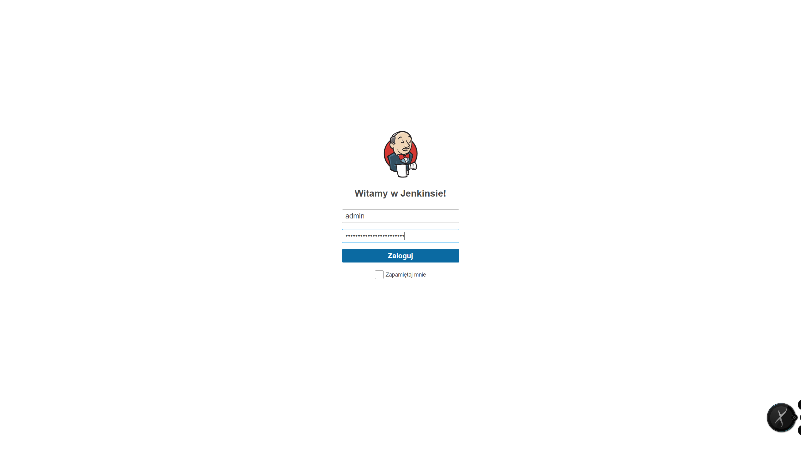
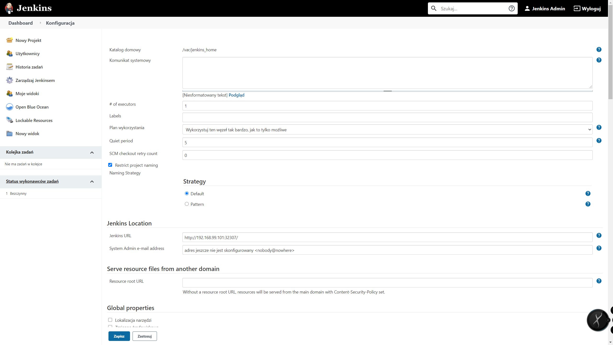
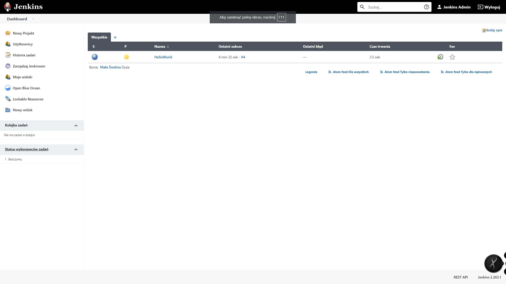
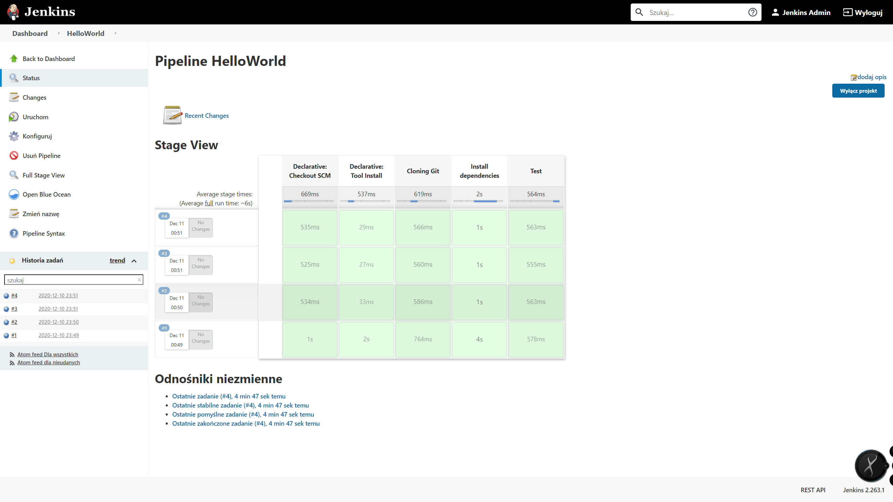
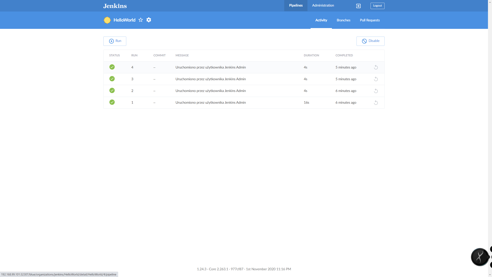
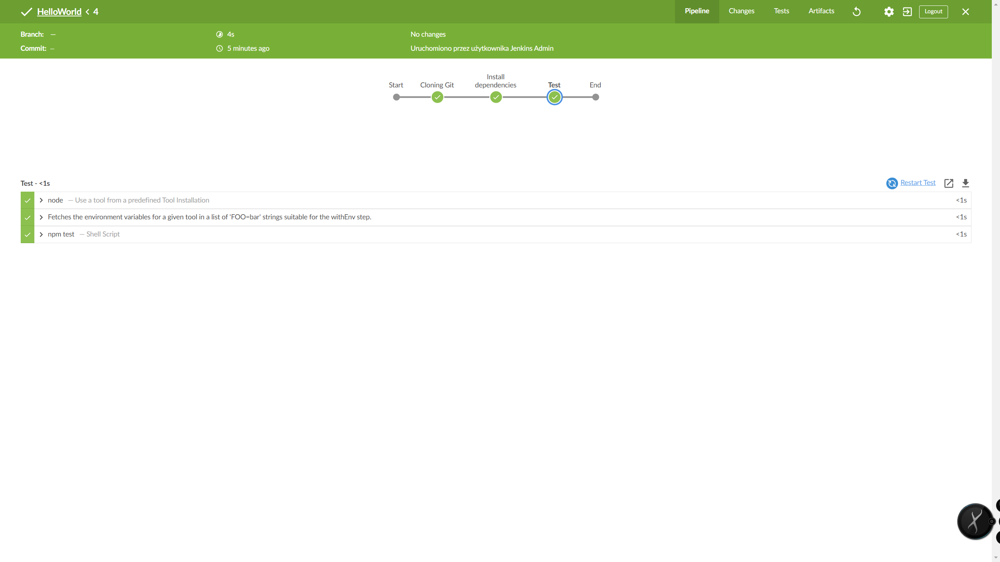
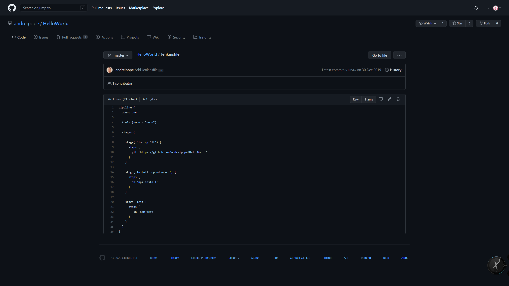
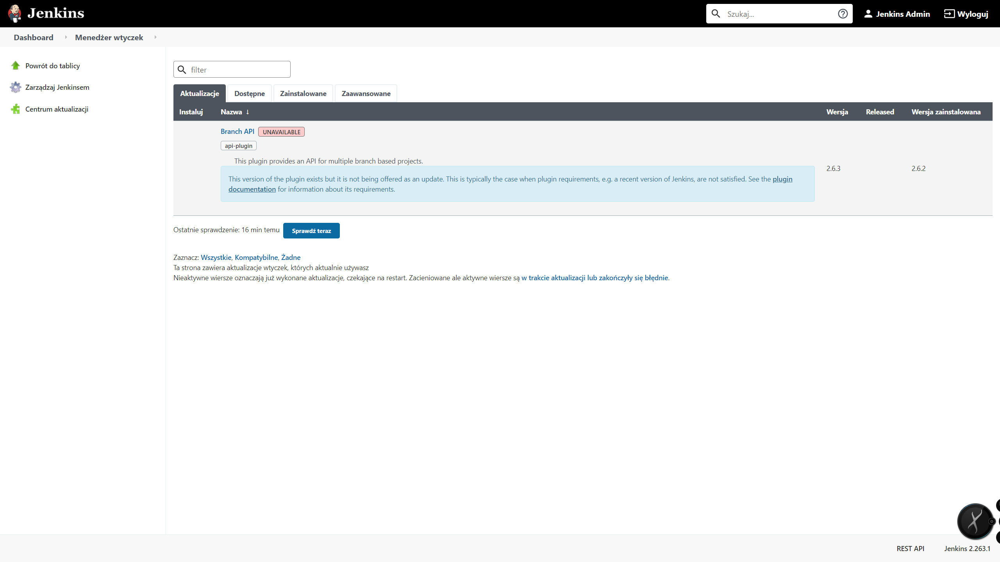

# Jenkins 1 team09

## Wstęp
W ramach zadania skonfigurowaliśmy i uruchomiliśmy środowisko CI Jenkins, w którym zbudowaliśmy przykładową aplikację [Node.JS](https://github.com/andreipope/HelloWorld/).

## Uruchomienie
Uruchomienie wymaga zainstalowania na systemie Windows aplikacji minikube, helm  oraz środowiska wirtualizacji np. VirtualBox.

```
minikube start --cpus=4 --memory=8g --disk-size=50g --addons=ingress
helm repo add jenkinsci https^^/charts.jenkins.io
helm repo update

kubectl apply -f jenkins-namespace.yaml
minikube ssh
sudo mkdir /data/jenkins-home
sudo chmod 777 /data/jenkins-home
kubectl apply -f jenkins-volume.yaml
helm install jenkins --namespace jenkins -f jenkins-values.yaml jenkinsci/jenkins
kubectl apply -f jenkins-smee-client.yaml
```

#### Pobieranie hasła i adresu logowania do Jenkins'a

W systemie Windows najlepiej użyc GitBash do wykonania poniższych komend.
```
jsonpath="{.data.jenkins-admin-password}"
secret=$(kubectl get secret -n jenkins jenkins -o jsonpath=$jsonpath)
echo $(echo $secret | base64 --decode)


jsonpath="{.spec.ports[0].nodePort}"
NODE_PORT=$(kubectl get -n jenkins -o jsonpath=$jsonpath services jenkins)
jsonpath="{.items[0].status.addresses[0].address}"
NODE_IP=$(kubectl get nodes -n jenkins -o jsonpath=$jsonpath)
echo http://$NODE_IP:$NODE_PORT/login
```

Ekran logowania

## Zrzuty ekranu konfiguracji i budowania przykładowej aplikacji


Konfiguracja adresu URL


Dashboard


Pipeline budowy aplikacji


Dashboard Blue Ocean


Pipeline w Blue Ocean


Jenkinsfile przykładowej aplikacji

## Wnioski
Jenkins jest interesującym narzędziem, które zdobyło ogromną popularność. Dostępne są różnorodne możliwości uruchomienia środowiska przy wykorzystaniu tego narzędzia. Narzędzie umożliwia uruchomienie stabilnej aplikacji, dbając o jej dostępność - w razie awarii samodzielnie potrafi zrestartować wadliwe pody. Kubernetes jest w naszej opinii trudnym narzędziem, w którym bardzo ciężko postawić pierwsze kroki, jednak oferuje bardzo dobrą dokumentację - znaleźliśmy w niej odpowiedź na nurtujące nas pytania. Wyzwaniem było umieszczenie konfiguracji bazy w secrets, jednak przy ponownym przeglądaniu dokumentacji zauważliśmy nas, nieoczywisty dla nas wcześniej błąd - w obecnej konfiguracji należy zaszyfrować wszystkie dane w BASE64, o czym zapomnieliśmy przy naszych nieudanych próbach. Właśnie takie malutkie nieoczywiste szczegóły i wymóg zapoznania się z dość rozległą dokumentacją w naszej opinii czyni to narzędzie trudnym dla początkujących.


Problem z aktualizacją wtyczki
